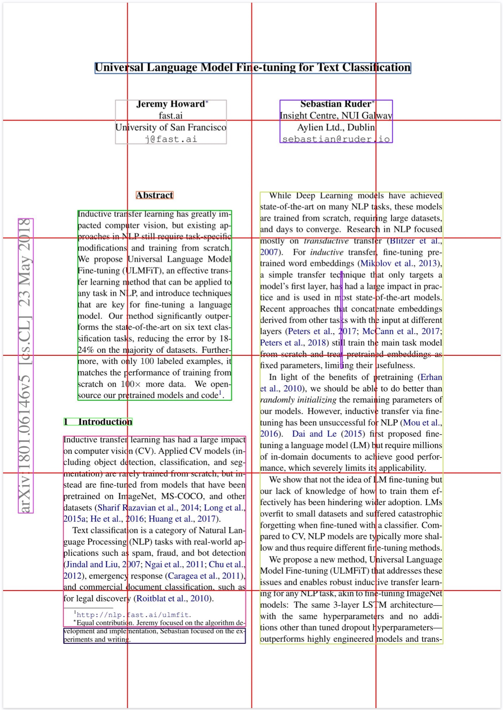

# docSilhouette

## What is it? 

This library wraps pytesseract and adds some useful features for text processing. Objevtively it takes information from the bouding boxes issued by tesseract and it exctracts some coherent information from the text aesthetic, like page and document position for each text block.

We also applied a greedy algorithm to organize the words in blocks, firstly processing lines, after that processing the groups of words as exposed by tesseract dataframe.

## How to use

You'd rather install the library using pip:

```shell
pip install docSilhouette
```

Then you can use it:

```python
from docSilhouette.docSilhouette import docSilhouette
doc = docSilhouette('./tests/assets/single_page.pdf')
doc.setup()
print(doc.get_text(True))
```

You might find output like the following

```shell
xxP001
xxQ01_00 xxbob 2018
May
23
[cs.CL]
arXiv:1801.06146v5
xxeob xxQ04_00

xxP001
xxQ00_00 xxbob Universal Language Model Fine-tuning for Text Classification
xxeob xxQ00_03

xxP001
xxQ00_00 xxbob Jeremy Howard*
fast.ai
University of San Francisco
j@fast.ai
xxeob xxQ01_01

xxP001
xxQ01_01 xxbob xxbcet Abstract xxecet
xxeob xxQ01_01

xxP001
xxQ01_00 xxbob xxbcet Inductive transfer learning has greatly im- xxecet
xxbcet pacted computer vision, but existing ap- xxecet
xxbcet proaches in NLP still require task-specific xxecet
xxbcet modifications and training from scratch. xxecet
xxbcet We propose Universal Language Model xxecet
xxbcet Fine-tuning (ULMFiT), an effective trans- xxecet
xxbcet fer learning method that can be applied to xxecet
xxbcet any task in NLP, and introduce techniques xxecet
xxbcet that are key for fine-tuning a language xxecet
xxbcet model. Our method significantly outper- xxecet
xxbcet forms the state-of-the-art on six text clas- xxecet
xxbcet sification tasks, reducing the error by 18- xxecet
xxbcet 24% on the majority of datasets. Further- xxecet
xxbcet more, with only 100 labeled examples, it xxecet
xxbcet matches the performance of training from xxecet
xxbcet scratch on 100x more data. We open- xxecet
source our pretrained models and code!.
xxeob xxQ03_01

xxP001
xxQ03_00 xxbob 1 Introduction
xxeob xxQ03_01
```

## Special Tokens

* `xxP001`: Page number
* `xxbob`: Begin of block
* `xxeob`: End of block
* `xxQ01_00`: Block number, where 01 refers to the first line of the page matrix and the 00 refers to the first column of the page. Check out the image bellow with a page with the matrix plotted on it. When set to issue quadrants, every block will have a `xxQ` for the beginning of the block and another for the end of the block. The following example highlights the quadrant of the block ``1 Introduction``, which starts at line 3 and column 0 and ends at line 3 and column 1. Refer to the image bellow for a more detailed example.

```shell
xxQ03_00 xxbob 1 Introduction
xxeob xxQ03_01
```

* `xxbcet`: centralized text line
* `xxecet`: end of centralized text line




## License
MIT